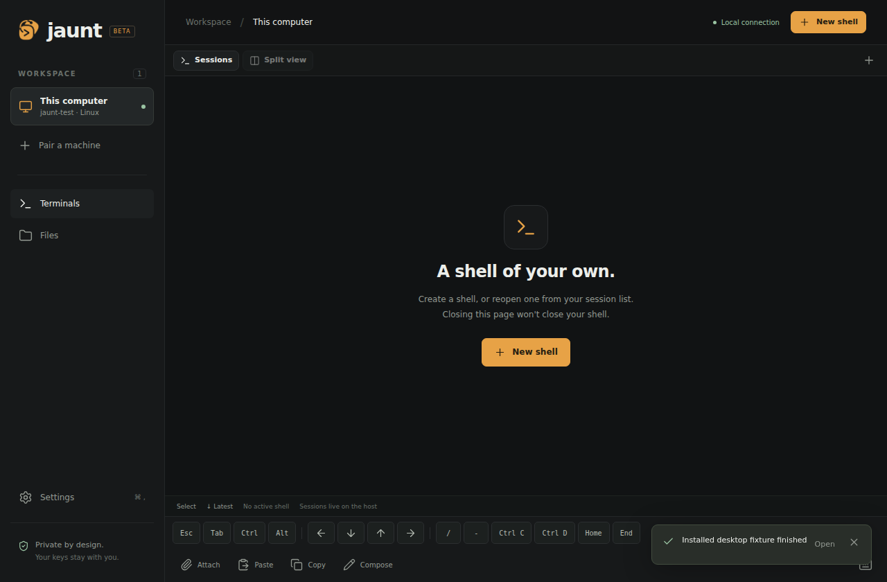

[English](../../../DELIVERY_REGRESSIONS.md) · [fr](../../fr/docs/DELIVERY_REGRESSIONS.md) · [es](../../es/docs/DELIVERY_REGRESSIONS.md) · [it](../../it/docs/DELIVERY_REGRESSIONS.md) · [pt](DELIVERY_REGRESSIONS.md) · [de](../../de/docs/DELIVERY_REGRESSIONS.md)

# Correcções de regressão da entrega — 15 de Setembro de 2026

Este relatório segue as falhas relatadas pelo usuário após a versão anterior. Testes de passagem anteriores não estabeleceram a inicialização correta do usuário shell, a rolagem de toque utilizável ou o caminho padrão de lançamento do arquivo Ubuntu.

## Causas e mudanças reproduzidas

- Os perfis de login do Bash podem omitir o `.bashrc`. O shell lançado pelo serviço, portanto, perdeu as adições interativas do PATH e as cores imediatas. Novas sessões carregam o ambiente de login e, em seguida, a configuração de bash interativa; o SHELL ausente usa a conta shell.
- Atualizações de host não atendidas ignoram as instruções de instalação e autorização do sistema da GUI. A instalação gráfica interativa e o `jaunt gui` explícito ainda instalam o aplicativo desktop.
- O arquivo de desktop publicado aborta em Ubuntu 24.04 espaços de nomes de usuário restritos com um erro de ajuda sandbox. O instalador agora seleciona o pacote de sistema verificado lá, permitindo que seu suporte AppArmor escopo seja instalado sem desativar o sandboxing Chromium.
- O logótipo nativo extraResource excluiu a sua fonte dos activos da Web embalados, quebrando o logótipo da aplicação. O recurso nativo agora usa um ícone de área de trabalho gerado, mantendo o original nos activos da Web.
- A embalagem de ícones Linux usou um diretório de temas não indexado de 547×547. Ele agora inclui oito tamanhos padrão derivados da arte original. Crie ganchos e permissões de ícones explícitas remover arquivos de lançadores unreadable umask-dependentes.
- Os pictogramas de UI agora vêm do pined Lucide 1.46.0, empacotado localmente com sua licença ISC. Android usa um invólucro de lançador adaptativo em torno da obra de arte fornecida.
- A nova sessão de UI não oferece mais tmux. As sessões existentes de tmux e a compatibilidade do host permanecem intactas.
- Os deslizes de toque Android não rolaram a viewport virtual do xterm. Um manipulador de toque fornece rolagem e momentum; o redimensionamento do teclado retém a âncora de leitura em vez de saltar para a primeira ou última linha.
- O texto da notificação do programa foi descartado. OSC 9 mensagens e OSC 777 título/corpo agora atingem notificações nativas. Os alvos da notificação permanecem pendentes até que seu host/session esteja disponível. Nenhum resultado do terminal seja raspado.
- A visão dividida está na barra de tabulação do desktop, com criação direta ao lado/abaixo, splits de sessão existente, layout persistente e backback de tabulação móvel.

## Validação local observada

- `npm install` / `npm audit`: dependências fixas e arquivo de bloqueio real; vulnerabilidades zero conhecidas no momento desta execução. Node 25.5.0, npm 11.8.0, Electron 44.3.0, construtor de elétrons 26.15.3.
- `.venv/bin/python -m pytest -q`: 63 passou em Python 3.14.2, incluindo real PTY login-PATH/color-prompt regressão e testes de conteúdo de notificação em bloco.
- `node --test tests/js.test.mjs tests/relay.test.mjs`: 21 passou.
- `npm run test:relay`: 2 testes reais de roteamento Miniflare/workerd passaram.
- `npm run prepare-web` e `.venv/bin/python scripts/check_project.py`: passado; jsQR local, xterm, Lucide e licenças.
- `.venv/bin/python scripts/build_release.py`: construiu uma roda não editável 01.0b9.
- `.venv/bin/python tests/browser_e2e.py`, também com `jaunt_E2E_RELAY=workerd`: 23 cenários passados por backend.
- `.venv/bin/python tests/terminal_render_e2e.py`: rolagem, âncora de leitura de altura do teclado, seleção e temas passados, além de real isolado Claude Code e Codex inicialização. Nenhuma execução autenticada do modelo é reivindicada.
- `DISPLAY=:179 .venv/bin/python tests/shared_workspace_e2e.py`: compartilhado local/remoto PTY, propriedade de geometria, descolamento/terminação e retrocesso de painel móvel passado.
- Android release/debug compila, fiapo e tarefas de unidade assinadas. `tests/android_workspace_e2e.py` no emulador Android 14/API 34 passou real touch swick, âncora de teclado real, insets de sistema, rotação, screen-off OSC title/body e tocando a notificação na sessão correta.

O candidato instalado `.deb` mais o renderizador não editável 0.1.0b9 passou no Ubuntu 24.04: execução real do PTY, Seccomp=2/NoNewPrivs=1, logos decodificados no aplicativo, Lucide localmente disponível e ícones de lançador padrão legíveis. O desktop candidato também autenticou através do relé público e provou um comando remoto. O `scripts/check_desktop_package.mjs` agora verifica estes caminhos de recursos embalados e metadados do Linux no CI.

Uma exportação de código-fonte limpo passou por gitleaks. A digitalização do binário ASAR produziu dois falsos positivos revisados nos identificadores JavaScript (`FourKeyMap` e `SequencerByKey`); nenhuma credencial estava presente.

## Entrega publicada

PR [20](https://github.com/moukrea/jaunt/pull/20) fundiu-se como `cb0cb99910978e0874cf00235a046f47ff297d72` depois de todas as verificações passadas. Backup O `backup/pre-delivery-fixes-20260915` preserva o estado anterior. Não foi usada nenhuma remoção de força ou histórico.

- Página pública: https://moukrea.github.io/jaunt/
- Máquina: [v0.1.0-beta.9](https://github.com/moukrea/jaunt/releases/tag/v0.1.0-beta.9), exatamente três ativos. Todas as somas de verificação, caminhos de arquivo e todos os 16 arquivos fonte Python/installer foram verificados contra a fonte entregue.
- Área de trabalho: [desktop- v0.1.0- beta.7](https://github.com/moukrea/jaunt/releases/tag/desktop-v0.1.0-beta.7), dez pacotes Linux/macOS mais SHA256SUMS. Todos os dez downloads corresponderam às somas de verificação. Pacote Ubuntu público instalado: execução real local e remota do shell, sessão compartilhada do navegador/desktop, terminação de ambos os lados, logotipo decodificado, ícones padrão legíveis e renderizador sandboxed.
- Android: [android- v0.1. 0- beta. 5](https://github.com/moukrea/jaunt/releases/tag/android-v0.1.0-beta.5), versãoCode 5. Os 27 recursos públicos da Web do APK combinaram com a fonte; o instalador do host é intencionalmente excluído pela compilação Android. Foi verificado o seu checksum e o certificado de assinatura existente. Instalando- o sobre o beta. 4 público, o APK reteve o emparelhamento e reconectou- se. A automação de UI nativa na versão APK então criou um shell, provou um resultado de comando no host e terminou a sessão. Não foi usada nenhuma compilação de lançamento debuggável.

O comando exato extraído da página pública passou em um novo recipiente Fedora 43 e uma nova conta no Ubuntu 24.04 VM:

```sh
bash -o pipefail -c 'curl -qfL --connect-timeout 10 --max-time 120 https://moukrea.github.io/jaunt/install.sh | bash'
```

A instalação gráfica interativa Ubuntu selecionou automaticamente o pacote de área de trabalho do sistema público. O serviço de host foi ativado, rodando e conectado; um QR SVG válido foi gerado sem imprimir ou publicar seu segredo. Atualizações de host desacompanhadas ignoram a configuração da GUI para que eles não possam ativar as instruções de autorização do desktop.

A página pública → Cloudflare → aceitação da roda pública passou 12 verificações: emparelhamento, entrada exata de 512 caracteres, múltiplos shells, comparação de byte de arquivo, imagem/caminho/no-Enter fallback, recarga, VM real IPv4/IPv6 interrupção da rede com a mesma sessão/PID, recusa em destruir shells ativo, reiniciamento explicitamente autorizado com identidades retidas, e revogação. Veja [os resultados observados](../../../evidence/public-report-beta9.json).

Este PC mantenedor também foi atualizado através do instalador público para hospedar 0.1.0b9 com suas chaves host/dispositivo existentes preservadas. Um shell criado por serviço temporário encontrou e executou `codex-cli 0.154.0` através do PATH e produziu um prompt colorido; somente essa sessão temporária foi terminada. O desktop público beta.7 foi instalado e permaneceu em execução no Ubuntu.

Provas IC: [controlos PR]](https://github.com/moukrea/jaunt/actions/runs/34960446113), [pacotes do desktop](https://github.com/moukrea/jaunt/actions/runs/34960446067), [Android](https://github.com/moukrea/jaunt/actions/runs/34960446100)Publicação: [host](https://github.com/moukrea/jaunt/actions/runs/34960988005), [desktop](https://github.com/moukrea/jaunt/actions/runs/34961170116), [Android](https://github.com/moukrea/jaunt/actions/runs/34961169894), [páginas](https://github.com/moukrea/jaunt/actions/runs/34961981670). Os 28 recursos verificados na página pública correspondem aos arquivos entregues sob `/jaunt/`. A saúde do relé existente e autenticada WebSockets passado; nenhum relé URL ou relé de terceiros foi inventado.



## Limites remanescentes

Fisico Android hardware, teclados/políticas de bateria específicos de fornecedores, reais Wi-Fi/comutação móvel, macOS runtime e ARM runtime não são validados por estes testes. Android testes emuladores são identificados como tal. Autenticado Claude Code/Codex as conversas não são cobertas por testes de inicialização isolados. **O protocolo permanece independentemente não auditado.**
